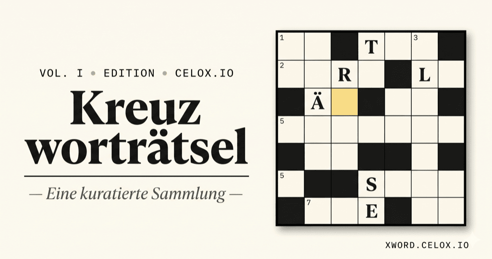

<div align="center">



# Kreuzworträtsel Framework

**Ein selbstständiges Kreuzworträtsel-Framework mit KI-gestützter Rätselgenerierung, Google-Login, Erfolgssystem und Offline-Modus.**

<!-- Repo stats -->
[](https://github.com/pepperonas/xword/stargazers)
[](https://github.com/pepperonas/xword/network/members)
[](https://github.com/pepperonas/xword/issues)
[](https://github.com/pepperonas/xword/commits/main)

<!-- License & tech stack -->
[](LICENSE)
[](https://developer.mozilla.org/en-US/docs/Web/JavaScript)
[](https://developer.mozilla.org/en-US/docs/Web/HTML)
[](https://developer.mozilla.org/en-US/docs/Web/CSS)
[](https://nodejs.org)
[](https://sqlite.org)
[](https://expressjs.com)

<!-- AI -->
[](https://www.anthropic.com/)
[](https://github.com/anthropics/anthropic-sdk-typescript)
[](https://claude.com/claude-code)

<!-- Quality -->
[](https://github.com/pepperonas/xword/actions/workflows/test.yml)
[](#)
[](#)
[](https://github.com/pepperonas/xword/pulls)
[](https://github.com/pepperonas/xword/commits/main)

<!-- Puzzle catalog -->
[](puzzles/)
[](puzzles/)
[](puzzles/)
[](puzzles/)
[](puzzles/)
[](puzzles/)
[](puzzles/)
[](puzzles/)
[](puzzles/)
[](puzzles/)
[](puzzles/)
[](puzzles/)
[](puzzles/)
[](puzzles/)

<!-- Misc -->
[](#)
[](#)
[](#)
[](#)

</div>

---

## ✨ Features

- 🧩 **12 kuratierte Rätsel** in drei Schwierigkeiten und zehn Themen — von Tech über Allgemeinwissen bis Klassische Bildung, Mythologie, Wissenschaft, Kunst, Geographie, Architektur, Sport und Musik
- 🤖 **Auto-Layout-Algorithmus** — du lieferst Wörter + Hinweise, der Algorithmus baut das Gitter (Standard-Kreuzwort-Regeln, multi-crossing-bevorzugend)
- 🪶 **Editorialer Zeitungsstil** — Fraunces-Display-Schrift, JetBrains-Mono-UI, papierweißer Hintergrund mit Goldakzenten
- 🔐 **Google-Login** (optional) — OAuth 2.0 mit serverseitigem Auth-Code-Flow, HttpOnly-Session-Cookies
- 💾 **Spielstand-Sync** pro Nutzer — jeder Tastenanschlag wird live gesichert, `sendBeacon`-Fallback beim Tab-Close
- 🌗 **Dark Mode** — Hell / Dunkel / System-Auto, persistiert in localStorage
- 📱 **PWA / Offline-Mode** — Web-App-Manifest + Service Worker, „Zum Home-Bildschirm" funktioniert
- ⚡ **Hardcore-Modus** — keine Highlights für korrekte Wörter, keine Live-Validierung, mutually exclusive zum Live-Modus
- 🏆 **Erfolgssystem** — 12 Erfolge in Bronze/Silber/Gold, Toast-Benachrichtigungen
- 🎖 **Rang-System** — 7 Stufen im Verlagsstil (Lesefuchs → Eminenz), basierend auf XP
- 🔥 **Streak-Counter** + ⭐ **Rätsel des Tages** — wiederkehrende Spieler werden belohnt
- 📊 **Bestenliste pro Rätsel** — Top-5 mit Avataren und Podium-Farben
- 👤 **Profil-Seite** — Rang, XP-Balken, Erfolge, persönliche Statistiken
- ⚙️ **Admin-Panel** für autorisierte E-Mails — User-Verwaltung, Aktivität, Rätsel-Stats, System
- 🖨 **Print-View** — `Cmd+P` druckt sauberes A4 mit Leer-Gitter + nummerierten Hinweisen
- 📤 **Share-Button** — Web Share API + Zwischenablage-Fallback
- 🔢 **Auto-Versionierung** — `git rev-list --count HEAD` als Versionsnummer in der Masthead-Eyebrow

---

## 🚀 Quick Start

### Spielen
Öffne https://xword.celox.io im Browser. Anmeldung optional — ohne Login spielst du, ohne dass etwas gespeichert wird. Mit Google-Login werden Spielstände serverseitig pro Nutzer persistiert.

### Selbst hosten / entwickeln

```bash
# Repo klonen
git clone https://github.com/pepperonas/xword.git
cd xword

# Frontend lokal starten (Server nötig — fetch() funktioniert nicht auf file://)
npm run serve                  # python3 -m http.server 8000
open http://localhost:8000/

# Tests ausführen
npm test                       # node --test tests/

# Versionsnummer aktualisieren (für Anzeige in der Masthead)
npm run version:bump
```

> Ohne Backend funktioniert die App im **Anonym-Modus**: keine Spielstand-Speicherung, kein Profil. Für Login + Speichern muss `server/` deployt sein (siehe unten).

### Backend lokal

```bash
cd server
cp .env.example .env           # fülle GOOGLE_CLIENT_ID, GOOGLE_CLIENT_SECRET, SESSION_SECRET aus
npm install
node server.js                 # läuft auf localhost:4242
```

Konfiguriere die Google Cloud Console mit OAuth-Client-ID und gib `http://localhost/api/auth/callback` als Redirect-URI an, wenn du auch Login lokal testen willst.

---

## 📁 Projektstruktur

```
xword/
├── index.html                  Single-Page-Shell mit 4 Views
├── manifest.webmanifest        PWA Manifest
├── sw.js                       Service Worker (offline + cache)
├── favicon.svg                 4×4 Mini-Crossword als App-Icon
├── xword.png                   Open-Graph-Thumbnail (1024×540)
├── impressum.html              Pflicht-Impressum
├── datenschutz.html            DSGVO-Datenschutzerklärung
├── package.json                Scripts: test, serve, version:bump
├── version.json                (gitignored) Auto-generiert aus git rev-list
├── LICENSE                     MIT
│
├── assets/
│   ├── styles.css              Light + Dark Theme, alle UI-Komponenten
│   ├── layout.js               Auto-Layout-Algorithmus (browser + node)
│   ├── engine.js               Spiel-Engine: Grid, Eingabe, Hardcore, Timer
│   ├── auth.js                 API-Wrapper, sendBeacon, makeSaver
│   └── app.js                  View-Routing, State, Theme-Manager, alle UI-Renderings
│
├── puzzles/
│   ├── index.json              Manifest: id, theme, difficulty, wordCount, size
│   ├── tech-easy-01.json       …
│   └── musik-hard-01.json      Pro Rätsel ein JSON mit Wörtern + Hinweisen + Layout
│
├── tests/
│   ├── layout.test.js          27 Tests für den Layout-Algorithmus
│   └── server/                 34 Tests für Backend (session, db, rate-limit, achievements)
│
├── server/                     Backend (Node + Express + SQLite, ES Modules)
│   ├── server.js               Express-App, Routes, Env-Loading
│   ├── db.js                   SQLite-Schema + prepared statements + Migrationen
│   ├── session.js              HMAC-signierte Cookie-Helpers
│   ├── rate-limit.js           Per-IP fixed-window counter middleware
│   ├── manifest.js             TTL-Cache für puzzles/index.json
│   ├── achievements.js         Rang-Tiers + Achievement-Defs + computeProfile
│   ├── scripts/backup.sh       Tägliche SQLite-Snapshots, gzip, 14d-Rotation
│   ├── xword-api.service       systemd-Unit für das Backend
│   ├── xword-backup.service    Oneshot für das Backup-Skript
│   ├── xword-backup.timer      Tägliche Auslösung 03:00
│   ├── nginx-snippet.conf      Vorlage für den /api/ Proxy-Block
│   └── .env.example            Env-Variablen-Vorlage
│
├── generator/                  KI-Generator (CLI, läuft lokal)
│   ├── generate.js             CLI: Claude API → Wörter → Layout → JSON → Manifest
│   ├── package.json
│   └── prompts/
│       ├── tech.md
│       ├── allgemein.md
│       ├── wissenschaft.md
│       └── film.md
│
├── scripts/
│   └── bump-version.sh         Erzeugt version.json aus git rev-list
│
└── .github/workflows/
    └── test.yml                GitHub Actions: npm test auf push + PR
```

---

## 🛠 Adding a new puzzle

### Variante A — Manuell

1. Lege eine neue Datei in `puzzles/` an:
   ```json
   {
     "id": "musik-easy-01",
     "title": "Klang & Rhythmus",
     "theme": "musik",
     "difficulty": "easy",
     "description": "Instrumente und Begriffe.",
     "words": [
       { "answer": "GITARRE", "clue": "Saiteninstrument" },
       { "answer": "PIANO",   "clue": "Tasteninstrument" }
     ]
   }
   ```
2. Layout zur Laufzeit (browser): einfach Manifest-Eintrag setzen — Engine berechnet die Positionen on-load
3. Layout vorab backen (deterministisch und performant):
   ```bash
   node -e "
   require('./assets/layout.js');
   const fs = require('fs');
   const p = require('./puzzles/musik-easy-01.json');
   const r = globalThis.XwordLayout.layout(p.words);
   p.size = r.size;
   p.words = r.words.map(w => ({ answer: w.answer, clue: w.clue, row: w.row, col: w.col, direction: w.direction }));
   fs.writeFileSync('./puzzles/musik-easy-01.json', JSON.stringify(p, null, 2));
   "
   ```
4. Manifest-Eintrag in `puzzles/index.json` hinzufügen
5. Regression-Test in `tests/layout.test.js` ergänzen

### Variante B — Mit KI (Prompt-Vorlage, manuell)

```bash
cat generator/prompts/allgemein.md | sed \
  -e 's/{{count}}/16/g' \
  -e 's/{{difficulty}}/medium/g' \
  -e 's/{{difficultyDe}}/mittel/g' | pbcopy
```
In Claude einfügen, die JSON-Antwort kopieren, in `puzzles/<id>.json` einbauen, Manifest aktualisieren.

### Variante C — Voll automatisch (Generator-CLI)

```bash
cd generator
npm install                    # einmalig: lädt @anthropic-ai/sdk
export ANTHROPIC_API_KEY=sk-ant-…

node generate.js --theme allgemein --difficulty medium --words 16
```

Das Skript ruft Claude (`claude-opus-4-7`), parst die Antwort, validiert, layoutet, schreibt JSON und aktualisiert das Manifest.

**Optionen:**
```
--theme tech|allgemein|wissenschaft|film|<eigenes>
--difficulty easy|medium|hard       (default: medium)
--words N                           (default: 16)
--title "Mein Titel"                (default: aus theme/difficulty)
--description "Kurztext"
--output ../puzzles/datei.json      (default: auto-nummeriert)
--model claude-opus-4-7             (default)
--dry                               (kein API-Call, Stub-Wörter — Test-Modus)
```

---

## 🎯 Auto-Layout

`assets/layout.js` enthält den Algorithmus. Browser + Node beide. Standard-Kreuzwort-Regeln:

- Kreuzungen müssen denselben Buchstaben teilen
- Nicht-Kreuzungs-Zellen dürfen keine parallel-benachbarten besetzten Zellen haben
- Wort-Endpunkte: Zellen davor und danach müssen leer sein
- T-Verzweigungen sind legal (zwei Down-Wörter kreuzen dasselbe Across-Wort)

Score: `crossings² × 500 + crossings × 50 − distance_to_center` — Mehrfach-Kreuzungen schlagen Einzelkreuzungen quadratisch.

Bis zu ~80–120 randomisierte Durchläufe; der kompakteste Versuch mit den meisten platzierten Wörtern gewinnt.

---

## 🧪 Tests

```bash
npm test
```

**61 Unit-Tests** (27 Layout + 34 Backend):

**Layout** (`tests/layout.test.js`):
- `normaliseAnswer` — Umlaute, Filter, leere Eingaben
- Platzierung — Einzelwort, Kreuzungen, Normalisierung, leere/degenerierte Eingaben
- Integrität — keine Buchstaben-Konflikte, keine Parallel-Berührungen, keine Wort-Verlängerungen
- Dichte — ≥ 1.5 Kreuzungen pro Wort bei 20+ Wörtern
- Regression — alle gelieferten Puzzles platzieren beim Re-Layout

**Backend** (`tests/server/*.test.js`):
- `session.test.js` — HMAC-Sign/Verify-Roundtrip, Tampering, Expiry, malformed Input
- `rate-limit.test.js` — Limits, 429 mit Retry-After, X-RateLimit-Header, Per-IP-Isolation
- `db.test.js` — Migrationen, idempotente Re-Runs, Upsert mit COALESCE, CASCADE-Delete
- `achievements.test.js` — Rang-Schwellen, computeProfile, Streak-Berechnung

GitHub Actions führt alle Tests bei jedem Push auf `main` und bei PRs aus.

---

## 🔐 Sicherheit

- **HSTS** mit `includeSubDomains`, Preload-fähig
- **CSP**: strict `script-src 'self'`, kontrolliertes `style-src 'unsafe-inline'` (nötig für JS-Style-Mutations), Google-Fonts + Google-Avatar-Hosts whitelisted, keine Frames
- **X-Frame-Options: DENY** + **Permissions-Policy** sperrt Kamera/Mikro/Geo/Payment/USB/Sensoren
- **Rate-Limits**: `/api/auth/*` 20/min, `/api/progress*` 300/min, catch-all 240/min
- **OAuth-State-Cookie** + Token-Verifikation via Google `tokeninfo`-Endpoint
- **Session-Cookies** HttpOnly + Secure + SameSite=Lax, HMAC-signiert
- **Tägliche DB-Backups** mit 14-Tage-Rotation via systemd-Timer
- **Hooks bei jedem Build** verhindern unsicheres `innerHTML` mit interpoliertem Inhalt

Keine Secrets im Repo:
- `.env`-Dateien gitignored
- `version.json` gitignored
- `*.db` gitignored
- Generator-`package-lock.json` gitignored (verhindert Token-Leaks aus Caches)

---

## 🎮 Bedienung im Spiel

| | |
|---|---|
| **Maus** | Zelle klicken → Wort aktivieren; erneut klicken → Richtung wechseln |
| **Hinweis-Zeile klicken** | aktiviert das Wort |
| **Pfeiltasten** | Navigation; erster Richtungswechsel wechselt nur die Eingaberichtung |
| **Tab / Shift+Tab** | nächstes / voriges Wort |
| **Enter** | Richtung des aktiven Wortes umschalten |
| **Buchstaben tippen** | ans aktive Feld; springt zum nächsten leeren Feld |
| **Backspace** | Buchstabe löschen; bei leerem Feld: ein Feld zurück |
| **Live-Validierung** | jede Eingabe wird sofort gegen die Lösung geprüft |
| **Hardcore-Modus** | keine Highlights, keine Live-Val — beide Toggles mutually exclusive |

---

## 📜 Lizenz

[MIT](LICENSE) — frei kopierbar mit Namensnennung.

Inhalt der Rätsel (Wörter + Hinweise) ist ebenso unter MIT. Die Schrift-Familien Fraunces, JetBrains Mono und Inter sind Open-Source-Schriften unter SIL Open Font License.

---

## 🙋 Credits

- Konzeption + Design: Martin Pfeffer (celox.io)
- Implementierung: gemeinsam mit Claude (Anthropic)
- Schriften: [Fraunces](https://fonts.google.com/specimen/Fraunces) · [JetBrains Mono](https://fonts.google.com/specimen/JetBrains+Mono) · [Inter](https://fonts.google.com/specimen/Inter)
- Inspiration: NYT, Süddeutsche, FAZ Kreuzworträtsel-Sektionen

Issues und Pull Requests willkommen.
